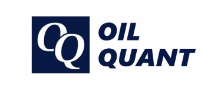

# 基于多维时序因子分解与机器学习的全球基准油价预测框架

项目团队：Oil-quant  
团队成员：庞世维、陈宏宇、李泽源、刘人畅、王家烜  
指导教师：李斌  
指导单位：武汉大学

此项目是第二十一届"花旗杯"金融创新应用大赛获奖作品，您可以在 [Oil Quant](http://oilquant.cloud/) 网站试用此产品。

## 项目简介

OIL-QUANT 是一个面向银行与企业两侧双重用户场景的油价风险量化分析平台，基于机器学习整合市场行情、多维因子数据、新闻舆情、量化预测模型与 AI 分析能力以帮助政企银监客户快速理解油价驱动因子、市场情绪变化与未来风险区间。
